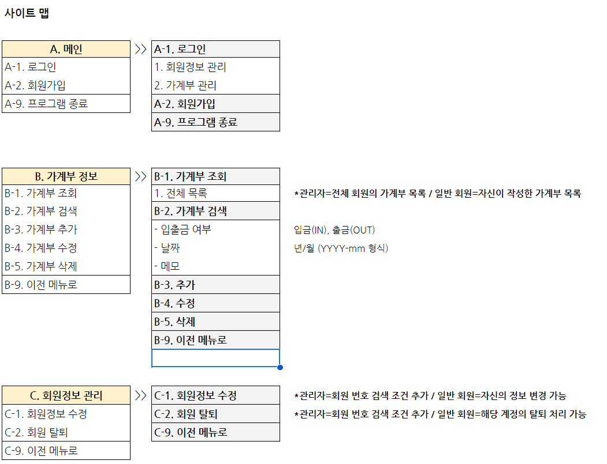

# DailyBudget

## 실행 방법
1. 프로젝트 루트의 `script/` 경로에 있는 sql 파일을 추가
  - `create.sql` : 테이블 생성 SQL
  - `insert.sql` : 더미 데이터 추가용
2. `Application` 실행
    - 로그인 
      - 관리자 계정: `admin`/`admin!23` (첫번째 추가 데이터)
      - 그 외는 일반 계정 

## 구조
